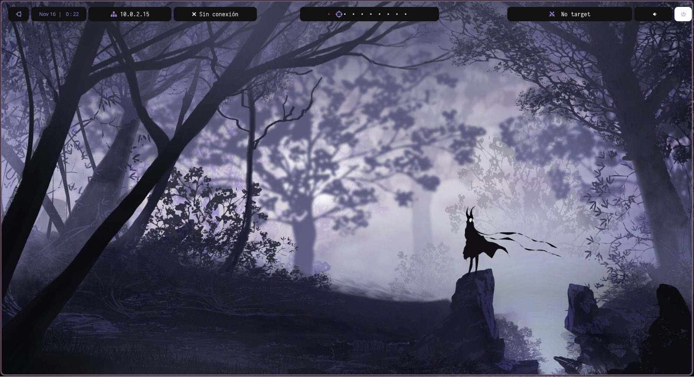

# ＢＳＰＷＭ  ＫＡＬＩ

*Este proyecto contiene mi entorno gráfico completo basado en **BSPWM** para Kali Linux.*




## Instalacion 
```bash
git clone https://github.com/espinalclark/Bspwm-Kali.git
cd Bspwm-Kali
chmod +x setup.sh 

