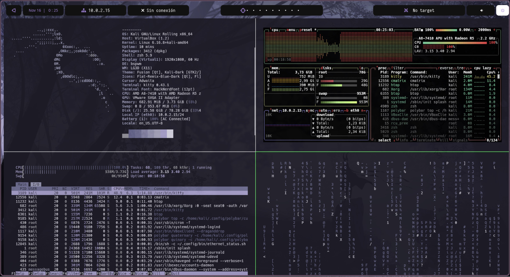
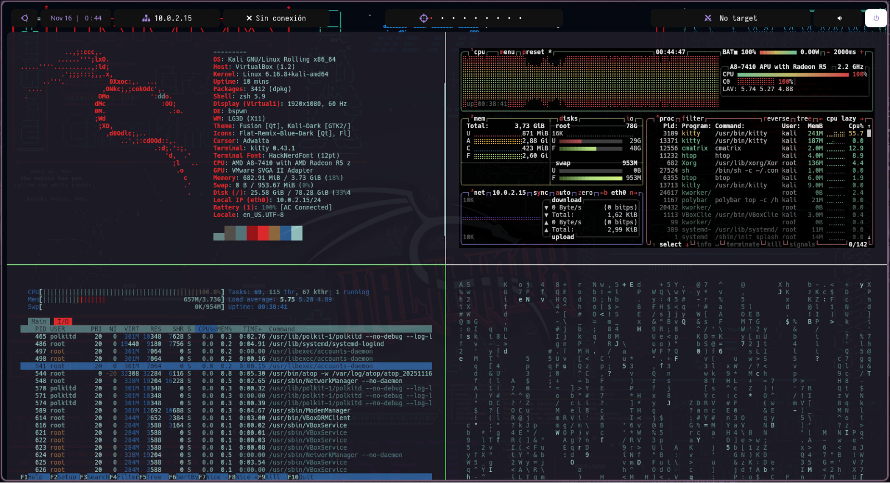
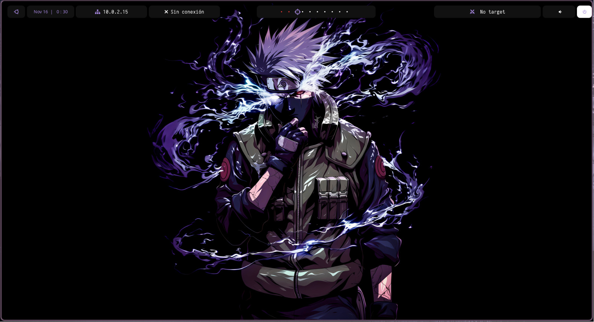
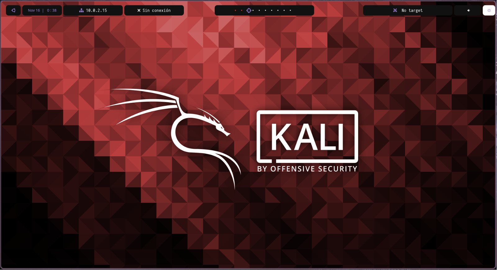

# ＢＳＰＷＭ  ＫＡＬＩ

*Este proyecto contiene mi entorno gráfico completo basado en **BSPWM** para Kali Linux.*





## Menu


## Wallpapers





## Instalacion 
```bash
- git clone https://github.com/espinalclark/Bspwm-Kali.git
- cd Bspwm-Kali
- chmod +x setup.sh
- ./setup.sh
```

## Estructura
```
config
├── bin                       <-- Scripts
│   ├── ethernet_status.sh
│   ├── htb_status.sh
│   ├── htb_target.sh
│   └── target
├── bspwm
│   ├── bspwmrc               <-- Atajos de teclados
│   └── scripts
│       └── bspwm_resize
├── hack.sh
├── kitty
│   ├── color.ini
│   ├── colors-kitty.conf
│   ├── colors.conf
│   └── kitty.conf
├── picom
│   └── picom.conf
├── polybar
│   ├── colors.ini
│   ├── fonts
│   ├── launch.sh
│   ├── scripts
│   │   ├── launcher
│   │   └── themes
│   │       ├── colors.rasi
│   ├── shapes
│   │   ├── bars.ini
│   │   ├── 
├── sxhkd
│   └── sxhkdrc
├── volumen.py                         <-- script para volumen
└── vpnhtb.sh                          <-- script para vpn status
```

## Adicional
- dar permisos de ejecucion  a los scripts de bin
- poner alias a los scripts en .zshrc
